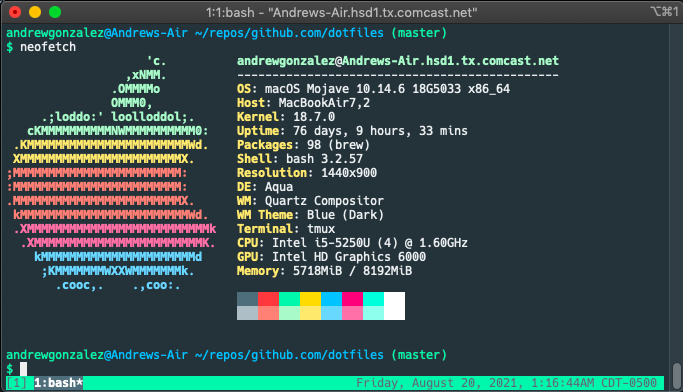

# Dotfiles

My dotfiles.



## Installation

```
$ git clone https://github.com/GonzalezAndrew/dotfiles.git

$ cd dotfiles

$ ./install.sh update
Updating dotfiles at /Users/andrewgonzalez...
bash or zsh? (bash): bash
Configuring for bash
done... :-)
```